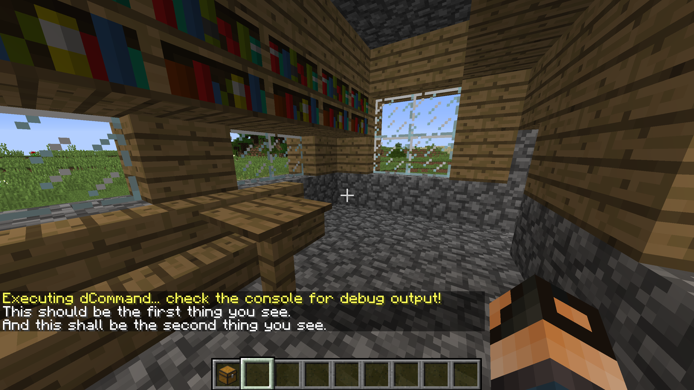

.. _basics-of-scripting your-first-task-script:

=========================
3. Your First Task Script
=========================

This section covers the video “`Setting Up A Local Test Server and Your First
Task Script`_” by mcmonkey.

.. _Setting Up A Local Test Server and Your First Task Script:
  https://one.denizenscript.com/denizen/vids/Setting%20Up%20A%20Local%20Test%20Server%20and%20Your%20First%20Task%20Script

.. contents::
  :local:

.. note::
  
  The beginning part of the video contains outdated information. You should not
  be downloading or using Craftbukkit. Instead, use the latest Spigot builds.
  You can find out more about obtaining a Spigot JAR at
  https://www.spigotmc.org/wiki/buildtools/.

Before We Start
---------------

We’ve been using task scripts in every example by now. To run a task script from
in-game, you can run the command ``/ex run TASK_SCRIPT_NAME``. Now what you need
to know is how they work.

Consider the following script:

.. code:: yaml
  :name: figure2_3_1
  :number-lines:

  myscript:
      type: task
      script:
      - narrate "Hello world!"

.. rst-class:: figurecaption

Figure 2.2.1: A simple task script

We know that ``myscript`` is the script’s container name. Therefore, all of the
indented lines underneath “``myscript``” are part of the same script. From
there, we can tell that the script type of ``myscript`` is ``task``, as
indicated by “``type: task``”. For a brief explanation on script container names
and types, refer to :doc:`Section 1.3 (dScript Format)
<../getting-started/dscript-format>`.

This leaves us with one last thing. The ``script`` section and all of the lines
that start with a dash ``-`` . What are they, and how do they work?

1. The "script" Section
-----------------------

For task scripts, the ``script`` section is the section that contains all of the
script that Denizen should run. Each line that starts with a ``-`` is a Denizen
**command**. Each command is run in the order that they are written in. Consider
the following example:

.. code:: yaml
  :name: figure2_3_2
  :number-lines:

  myscript:
      type: task
      script:
      - narrate "This should be the first thing you see."
      - narrate "And this shall be the second thing you see."

.. rst-class:: figurecaption

Figure 2.2.2: A task script with two commands

When you load this script to your server and run it in-game using ``/ex run
myscript``, you will see those two lines printed to your chat. The image below
shows the expected result:

.. rst-class:: figurecaption

Figure 2.2.3: The expected results when running the script in :ref:`Figure
2.3.2<figure2_3_2>`.

As indicated by the above figure, the script runs every command in order. This
is true for all Denizen scripts, not just task scripts. So don't worry about a
script suddenly running commands in a completely random order. This should never
happen, unless you have a block of script nested in a ``random`` command.

Despite knowing all of this, there is one thing we didn't really cover up until
now. What *is* a task script?

2. What Are Task Scripts?
-------------------------

.. todo
  Finish this section
